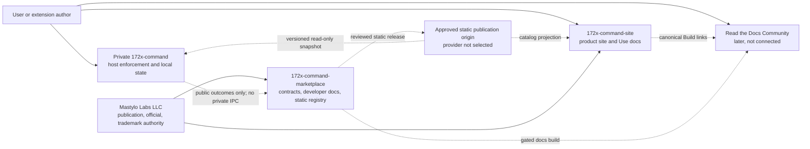
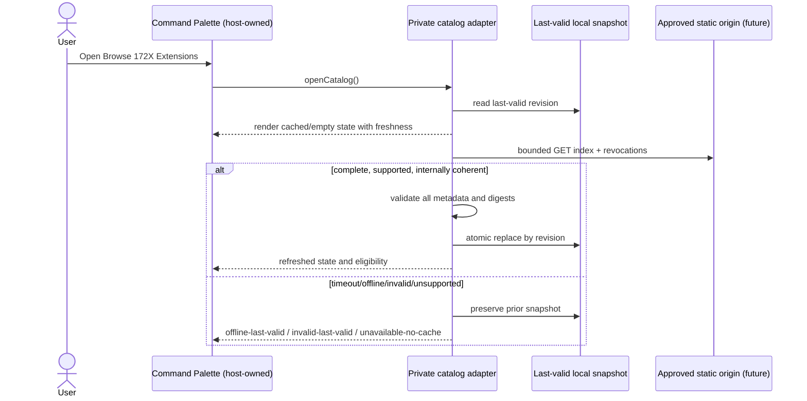

# 172X Command Marketplace and Cross-Repository Architecture/Contracts

## Result and identity

| Field | Value |
| --- | --- |
| Artifact ID | `DA-W0-ARCH-001` |
| Version | `0.1` |
| Date | 2026-08-27 |
| Artifact path | `/Users/zbigniew/dev/code/172x-command-marketplace/docs/architecture/172x-command-marketplace-and-integration-architecture-v0.1.md` |
| Authoring role | 172X Principal Architect |
| Authoritative input | `172X-BRIEF-CMD-W0-001` v0.1, SHA-256 `2b182db802c9bfaec5820a26265b1b8d8823ecc85e529d33c78594880a066fb4` |
| Scope | Marketplace and cross-repository architecture/contracts; narrow future private-Command integration boundary |
| Status | **PROPOSED FOR INDEPENDENT REVIEW; NOT IMPLEMENTED; HUMAN BUILD GATE CLOSED** |
| Required next receiver | `172x-design-architecture-reviewer`, after the fixed `DA-W0-UX-001` version also exists |

This specification uses **MUST**, **MUST NOT**, **SHOULD**, and **MAY** for the behavior of a later,
separately authorized implementation. It does not make that implementation, a catalog, a public
SDK, a package, a documentation deployment, or a provider configuration exist today. “Current”
means evidenced current behavior; “proposed” means a contract selected in this architecture;
“later” means outside the first authorized implementation and subject to another gate.

## Summary

The smallest defensible marketplace is a versioned static registry and declarative package
contracts owned by `172x-command-marketplace`, consumed by the site and by a narrow host-owned
module in the private `172x-command` application. It needs no service, queue, database, account,
payment path, or downloaded executable runtime.

Current truth is preserved:

- Widgets are reviewed React source compiled into the trusted Command renderer. Their capability
  API is repository discipline, not a security sandbox.
- Themes are bounded declarative data validated before application, with a known-good fallback.
- Command Palette entries are host-constructed in memory; there is no marketplace entry today.
- the trusted Tauri window exposes private native commands for project, filesystem, terminal,
  process, Git, local notification, and other host behavior. Marketplace availability or package
  installation grants none of that authority.
- `172x-command-marketplace` is a private pre-release policy foundation with no catalog, package
  schema, supported SDK, validator, public contribution path, or developer-doc deployment.

The proposed first model uses **Extension** as the umbrella and **Theme** as the canonical technical
name; **Skin** is a one-to-one user-facing synonym, never a separate manifest type. Initial contract
types are Theme, Widget, and Panel, but their delivery modes differ: Theme and Panel are inert
declarative data; Widget source is reviewed and compiled into a particular Command build and can be
enabled or placed only when already bundled. Candidate Command packages are deferred. No package
type implies downloaded JavaScript, native code, CSS, shell commands, or arbitrary host callbacks.

The one behavior that must not fail is **safe local Command operation and recovery**: catalog,
documentation, network, payment, publication, and provider failure must never block local/free-core
files, terminals, project recovery, process control, or the last valid local appearance/layout.

## Goals and non-goals

### Goals

- Define canonical ownership across site, marketplace, private Command, and Mastylo Labs LLC.
- Define complete discovery, details, manifest, package, compatibility, lifecycle, trust,
  capability, failure, recovery, documentation, and publication contracts.
- Keep initial distribution static, deterministic, reviewable, cacheable, and fail-closed.
- Permit future Command Palette discovery and explicit lifecycle actions through a narrow public
  contract while private implementation and authority remain private.
- Preserve last valid/local state across invalid catalogs, failed installs, failed migration,
  denied authority, offline operation, deprecation, revocation, and provider failure.
- Supply traceable evidence classes for later representative packages, heavy testing, independent
  review, and a human publication/build decision without inventing thresholds.

### Non-goals

- Implementing code, schemas, validators, packages, SDKs, CI, MkDocs, catalog hosting, application
  UI, or provider configuration.
- Choosing detailed website or in-app marketplace UX, copy, layouts, consent dialogs, or
  interaction choreography.
- Authorizing a runtime for downloaded executable code, arbitrary JavaScript/CSS, native binaries,
  shell commands, terminal input, project/filesystem access, credentials, or unrestricted network.
- Creating a service, queue, database, signing platform, sandbox, billing system, entitlement
  system, account, telemetry path, or deployment pipeline.
- Changing repository, package, core, site, trademark, commercial, contributor, security, or other
  legal policy; this artifact is not legal advice.
- Making a repository public, accepting contributions, publishing docs/packages, connecting Read
  the Docs, changing DNS, or claiming a URL/provider state.
- Defining numeric scale, latency, cache-age, support-window, test-count, availability, response, or
  accessibility-conformance targets not supplied by an approved owner.

## Source authority and exact evidence

### Authoritative and applicable documents

Every source below was read completely from the exact working-copy content identified here.

| Evidence ID | Source identity | SHA-256 | Authority and use |
| --- | --- | --- | --- |
| `ARCH-SRC-001` | `172X-BRIEF-CMD-W0-001` v0.1, `/Users/zbigniew/dev/code/172x-command/private/docs/172x-command-wave-0-parallel-program-build-brief-v0.1.md` | `2b182db802c9bfaec5820a26265b1b8d8823ecc85e529d33c78594880a066fb4` | Controlling Wave 0 scope, constraints, shared contracts, acceptance, and closed gate |
| `ARCH-SRC-002` | `/Users/zbigniew/dev/code/172x-command-marketplace/README.md`, clean observed head `a68a75464bf394df09de1e03b94f3b7075174e81` | `333cffa764b1c1fbf96d8eddd319102c8bc9f3b1955a6eac95b04793698208f8` | Current private pre-release repository boundary and planned types |
| `ARCH-SRC-003` | `/Users/zbigniew/dev/code/172x-command-marketplace/CONTRIBUTING.md`, same observed head | `2184c1c07f4ad446d753290b0d1a1d98906dad00adbf442e444b040b6d863f34` | Planned metadata, validation, review, lifecycle, accessibility, and provenance obligations |
| `ARCH-SRC-004` | `/Users/zbigniew/dev/code/172x-command-marketplace/GOVERNANCE.md`, same observed head | `15363836067bd5097ec6a20ccf9f27332e084ce3ca615fec7b28f70d021c058c` | Maintainer, package, publication, classification, and removal authority |
| `ARCH-SRC-005` | `/Users/zbigniew/dev/code/172x-command-marketplace/SECURITY.md`, same observed head | `169765af03a56f7fc5de3d4d8a4959ecd214b56b805093e8e7ccca6225ff4548` | Current no-release state and relevant threat classes |
| `ARCH-SRC-006` | `/Users/zbigniew/dev/code/172x-command-marketplace/TRADEMARKS.md`, same observed head | `077958f4647f51e167e6aa963b95078e369855ba9d5e8d7e296f3fa2f2604d66` | Existing trademark/official-label boundary; preserved, not re-adjudicated |
| `ARCH-SRC-007` | `172X-ARCH-AEC-004` v0.4, `/Users/zbigniew/dev/code/172x-command/docs/architecture/172x-command-architecture-addendum-v0.4.md` working copy | `36063b922c0d57c35ea1531cb054401d7bd5472d39d5f7df1f3ecde55c0f2279` | Accepted current compile-time/declarative architecture; implementation evidence pending |
| `ARCH-SRC-008` | `172X-SPEC-AEC-004` v0.4, `/Users/zbigniew/dev/code/172x-command/docs/product/172x-command-product-specification-addendum-v0.4.md` working copy | `963ee2683798b3cab203b1410364069ab5bbd15bc882591f90dd1587d2444054` | Normative bounded current behavior and non-goals |
| `ARCH-SRC-009` | `/Users/zbigniew/dev/code/172x-command/docs/contributors/intelligence-and-theme-contributions-v0.1.md` working copy | `72722a4870f4b14699fe20dbb639b3e3595b61aefa08703d51a616667af6d792` | Current contributor truth: compiled Widgets, declarative Themes, no runtime loader |

`ARCH-SRC-001` controls this program. `ARCH-SRC-007`–`009` control only the current behavior they
describe; they do not authorize the future contracts below. Existing marketplace policy controls
within its current scope. This artifact makes no silent legal-policy change.

### Read-only Command working-tree observations

On 2026-08-27, read-only inspection found Command on
`feat/intelligence-plugins-platform-support` at
`35e7bba0b9f48fc0130d22c3b211a3698203b288` with extensive pre-existing tracked and untracked user
work. The hashes below identify the inspected bytes. These are **working-tree observations, not
released contracts, approvals, or support evidence**.

| Observation group | Inspected paths and SHA-256 identities | Direct observation |
| --- | --- | --- |
| Intelligence type/registry | `src/intelligence/contracts.ts` `9bb8ed7e0127440fdaa17d9d68ca4861d7608d01fc04f31dc8cfdf0b13d9ae85`; `registry.ts` `053318396c247537701930b41984c08b5aa2586d59583d1082f5962af91d6ce6` | Literal internal API `1`; typed React Widget contributions; namespaced IDs; semantic contribution versions; exact capability declarations; deterministic duplicate/incompatible rejection |
| Intelligence host/capabilities | `src/intelligence/capabilities.ts` `42f8d8345513bf7e4050b7e829e261a5271254fdddb0c57399df76844340fcf1`; `IntelligenceHost.tsx` `efaba887ac556556ac0cf4c93e6834adb1deb3d34b41be8987898eaacb845ce1` | Host intersects declared and available capabilities, owns lifecycle state, aborts stale scopes, contains widget errors, and renders unavailable/error/retry states; compiled code still shares renderer trust |
| Intelligence storage | `src/intelligence/storage.ts` `9c4966716362bbb09f9b573a580dea3ef67c775e3c7574394e60a637f9a12acd` | Browser-local namespaced non-secret JSON preferences, per-namespace quota, schema-version migration, source preservation on failed migration, and scoped reset; this storage mechanism is not a future public persistence promise |
| Theme boundary | `src/themes/contracts.ts` `d55374c02f8dea3ef071ee8648aac51b94be8dd5b60a4fa952aaf15c25f4c538`; `validator.ts` `a88d444bf3c3584ecfbf49943b6b73eefa0039d778ef305bd304606cacf0c696`; `registry.ts` `b34daa66f1c04f1a5d1461c81454d7a77228e6b3306468f3f1cbc53cc1a2ed01` | Exact declarative semantic/terminal/syntax tokens; unsafe/unknown content and contrast failures rejected; validated fallback retained; preview/apply persistence is host-owned |
| Palette/navigation | `src/components/CommandPalette.tsx` `9d5365512d403d8876b490414613d466e69a30333b70552fb48662c24fa13059`; `src/App.tsx` `485e27be5166ed35f30459cf0f2c093f1d6e89476315422e2dd623a8dd426c6f`; `src/features/surfaces/contracts.ts` `ca4a063649c6ca8e39905abb24d37c2147ec74acef06cd33c7d51b57ceeec6d3` | Palette receives a static host-created command array. Bottom tools and operational surfaces are host-owned. No marketplace command or package-contributed callback exists |
| Tauri capability/config | `src-tauri/capabilities/default.json` `00d6cb9c9fe7eacc6820bf35415ddd7ae046ed44e611718abb4c4a8d20a5a1c3`; `src-tauri/tauri.conf.json` `f22e3358189512a7375cbf8c6fd37804b7b9b55fed75f9a16ca1b4ee59e5ce06` | One trusted first-party main webview has Tauri window/dialog/notification capabilities and internal-alpha configuration. This is not an extension permission boundary |
| Native IPC and authority | `src-tauri/src/lib.rs` `fdfe84ce0049722d4afc591e3b18c7a5f34d38de90b8ad5c42e3bc7a9222175b`; `project.rs` `a0841bc42c9e3b40571ed2469f0e02160408a1f280c08b8b4171d09cfd5c4e24`; `terminal.rs` `9ac72706ee9ce1581da8db4df64077d218db722843fd22029f0e71ad79d72505` | Trusted IPC registers broad private project/file/Git/terminal/process operations. Project authority is explicit, in-memory, identity-bound, descriptor/no-follow constrained; terminal launch is separately validated. No package-facing broker exists |

The Marketplace repository was observed clean on `main` at
`a68a75464bf394df09de1e03b94f3b7075174e81` before this artifact, and this target path was absent.
No remote fetch was run. No application, provider, native, security, accessibility, or runtime test
was performed for this architecture.

### Evidence labels used below

- **Fact** — supplied direction or exact identified source content.
- **Observation** — direct local inspection identified above.
- **Inference** — conclusion linked to facts/observations.
- **Decision** — proposed architecture choice within this role's boundary.
- **Assumption** — reversible premise with impact and validation owner.
- **Unknown** — missing evidence or authority retained for its owner.

## Constraints and derived non-functional behavior

No unsupported numeric target is introduced.

| Sourced outcome | Quality attribute | Measurement boundary/evidence | Required architecture behavior | Unknown/owner |
| --- | --- | --- | --- | --- |
| Safe local/free-core behavior cannot depend on remote systems | Availability and fault isolation | Exercise local core with catalog/docs/network/payment unavailable | Remote failure cannot disable files, terminals, projects, recovery, or last valid local state | Later QA owns direct evidence |
| Invalid, incompatible, altered, duplicate, unsafe, or unsupported packages fail closed | Integrity and compatibility | Deterministic fixtures plus host-bound lifecycle tests | Validate before visibility/action; never expand authority on uncertainty; preserve prior valid state | Exact validator implementation later |
| Permissions are least-authority and revocable | Security | Capability declaration/grant/deny/revoke matrix at an immutable build | Request is not grant; host intersects contract, policy, consent, and runtime availability | Product/security and later application UX own public capability set/consent |
| Static/simple architecture is preferred | Operability and delivery | Repository artifacts and local/CI checks, not a service SLO | One coherent static snapshot, immutable package bytes, local evaluation, no database/queue/service | Static publication origin remains human-gated |
| Catalog and docs may be stale/offline | Durability and truthfulness | Valid-cache, corrupt-cache, no-cache, offline, and rollback scenarios | Atomically retain last valid snapshot; expose age/status; never call stale data current | Freshness threshold is an approved product/support decision |
| Accessible state is required at every applicable surface | Accessibility | Semantic-state contract plus later keyboard/AT/zoom/contrast/motion evidence | Stable machine-readable state, message, reason, available actions, and status-change semantics | Exact conformance baseline/targets remain open |
| Compatibility/support claims require evidence | Support truth | Exact package, host, platform, contract, and test-head matrix | Separate declared, validated, host-tested, and supported evidence; no promotion by compilation alone | Human/release owner approves support baseline |
| Private source and authority must not leak | Confidentiality and boundary control | Public-content/private-interface audit and threat review | Public contracts contain identifiers and outcomes only; no private IPC names, source paths, credentials, or implementation types | Later security review owns proof |

## System context and boundaries

The dashed boundaries and all remote surfaces are proposed, not current.



### Stage boundaries

| Stage | State | Permitted architecture/behavior | Explicitly absent or blocked | Exit authority |
| --- | --- | --- | --- | --- |
| `W0` — current | Evidenced now | Private policy foundation; compile-time Widgets; declarative built-in Themes; static host Palette; local/private Command authority | Catalog, package loader, runtime marketplace, public SDK/docs, install/update/revoke integration | This artifact and independent review only |
| `W1` — private contracts | Proposed, not authorized to build | Versioned manifest/catalog/docs contracts, static fixtures, validators, representative source packages, local/CI MkDocs | Public URLs, provider connection, downloadable executable code, user-facing availability | Human build decision after independent review |
| `W2` — private host integration/testing | Later | Private Command consumes static fixtures; inert Theme/Panel staging; bundled Widget enable/placement; lifecycle, failure, rollback, accessibility and security evidence | Public repository/catalog/docs; candidate Command type; executable packages | Separate build brief, QA/security/review, human gate |
| `W3` — public declarative marketplace | Later | Public source and static catalog after gates; RTD Community at planned initial URL; compatible declarative packages and bundled-Widget truth | Automatic provider setup; commerce dependency; arbitrary executable runtime | Human publication record and actual provider/repository actions |
| `W4` — later type/runtime evolution | Unspecified and blocked | Only separately approved package types or isolation designs | No implied JavaScript/native/renderer runtime; no inherited capability authority | New product, threat, architecture, UX, security, implementation, review, and human gates |

Stage labels are monotonic evidence states, not dates. W0 does not automatically advance.

## Canonical cross-repository ownership

| Truth or artifact | Canonical owner/source of truth | Consumers | Contract and anti-drift rule |
| --- | --- | --- | --- |
| Product brand, story, navigation, downloads, updates, supporter presentation, community/support routes | `172x-command-site`, under Mastylo Labs LLC product authority | Users, Command, marketplace links | Marketplace MUST NOT duplicate product/commercial promises or claim live availability |
| Product/user MkDocs | `172x-command-site`, planned at `https://command.172x.ai/docs/` | Users; marketplace may deep-link | **Use 172X Command** content is site-owned; Build pages are a gateway, not a copied contract source |
| Extension developer docs | `172x-command-marketplace` | Site Build gateway, authors, Command help links | Marketplace version is canonical for schema, capabilities, compatibility, lifecycle, and review policy |
| Manifest, package-type, compatibility, catalog, review and lifecycle contracts | `172x-command-marketplace`, versioned release unit | Private Command, site projection, authors | Consumers pin supported contract versions; they do not infer behavior from private code |
| Published catalog metadata and tombstones | Reviewed marketplace release at one immutable registry revision | Command and site read-only projections | One snapshot is coherent; cache is a projection; local installation state is not catalog truth |
| Actual local package/lifecycle/permission/placement state | Private `172x-command` host | Command UI and diagnostics | Marketplace cannot mutate local state; host does not publish private IPC or filesystem locations |
| Capability enforcement, core/native authority, shell/terminal/filesystem/project/credential behavior | Private `172x-command` | Public contract exposes only bounded capability IDs and outcomes | Installation/source availability never creates authority; private Tauri commands are not public extension APIs |
| Package source, maintainer, and package-specific license | Identified package source plus immutable manifest evidence; publication accepted by marketplace governance | Catalog, docs, users | Repository license and package license remain separate; this architecture gives no license advice |
| Marketplace repository license/policy | Existing marketplace policy files | Contributors/users | No change here; not a core/site/package/trademark license |
| Official designation, trademarks, publication, release, commerce | Mastylo Labs LLC/human authorized record | All surfaces render approved facts | Merge, CI, source review, or catalog inclusion does not imply official status, permission, public release, or purchase availability |

## Public extension taxonomy and delivery boundary

### Canonical glossary

| Term | Contract meaning | Current/W1/W2 treatment | Later boundary |
| --- | --- | --- | --- |
| **Extension** | Umbrella for a versioned Theme, Widget, Panel, or later approved type | Canonical umbrella now | Does not imply executable code |
| **Theme** | Canonical technical type for inert appearance tokens and bounded metadata | Current built-ins only; proposed declarative install/preview/apply in W2 | May evolve only through versioned declarative contract |
| **Skin** | User-facing synonym for exactly one Theme | Alias only; MUST resolve to `type=theme`; never a package type or compatibility axis | Product owner may retire or retain the alias without data migration |
| **Widget** | Bounded card contribution rendered by a suitable host Panel | Current and initial model: reviewed source compiled/bundled into a Command build; marketplace action is Enable/Add to Panel when bundled, otherwise Requires Command update | Downloaded executable Widget runtime is blocked pending W4 gates |
| **Panel** | Declarative host-owned surface/template and compatible Widget slot arrangement | Proposed inert data type; installation does not open it or place Widgets | Executable Panel controllers are not authorized |
| **Command** | Candidate package describing a Command Palette entry backed only by an approved host action | **Not an initial eligible type. Reserved/later; must render unavailable or absent** | Requires product-owner approval, capability/action contract, detailed in-app UX, security review, and a new gate; arbitrary callbacks/shell strings remain forbidden |

**Decision `ARCH-W0-D001`:** initial public contract scope is Theme, Widget, and Panel with explicit
delivery mode; Command is later. This bounds `UNK-W0-001` without claiming product-owner approval.
Before public-facing use, the product owner must confirm the Theme/Skin presentation and Command
deferral. A representative Theme plus a deterministic bundled Widget exercise the two materially
different delivery modes; the exact 1–2 packages remain a later human choice.

### Package type and authority matrix

| Type | Initial delivery mode | Acquirable from static origin? | Initial explicit actions | Payload authority | Prohibited implication |
| --- | --- | --- | --- | --- | --- |
| Theme | `declarative-data` | Proposed in W2 after host support | Install, Preview, Apply, Cancel, Revert, Update, Disable, Uninstall | Exact validated appearance tokens only | CSS, scripts, URLs, fonts, assets with active behavior, host/native authority |
| Panel | `declarative-data` | Proposed in W2 after host support | Install, Enable, Open/Activate, Disable, Uninstall; placements remain explicit | Host-owned layout/slot descriptors and references to compatible Widget IDs | Executable UI/controller code, automatic Widget placement, core/dock/native authority |
| Widget | `host-bundled-source` | Source may be public; **runtime code is not downloaded or installed** | Enable/Disable when bundled; Add to/Remove from suitable Panel; update only with Command build | Reviewed compiled code receives only host-provided context; same-renderer trust is disclosed | Runtime isolation, package install, or safety from a capability declaration |
| Command | `reserved` | No | No actionable lifecycle in initial contract | None | Palette injection, callbacks, shell/terminal/native actions |
| Unknown/future | `unsupported` | No | View reason only | None | Forward-compatible execution or permissive fallback |

The manifest MUST carry `type` and `deliveryMode`; the host MUST reject invalid combinations. A
future isolated runtime requires a new delivery-mode value and contract major. It cannot reinterpret
`host-bundled-source` or `declarative-data`.

## Proposed components, ownership, and contracts

| Component/boundary | Responsibility | Owns | Interfaces |
| --- | --- | --- | --- |
| Marketplace contract release | Versioned manifest/catalog/type/capability/lifecycle rules and examples | Contract majors, schema identities, docs version | Static files and human-reviewed repository release |
| Catalog builder/validator (future) | Deterministically validate one coherent registry snapshot | Generated snapshot and validation report, not policy authority | Local and CI command parity; no network service required |
| Static publication origin (future, provider unselected) | Serve immutable manifests/payloads and a versioned snapshot read-only | Availability of published bytes only | Bounded HTTPS GET; no account/session/write API for clients |
| Marketplace developer docs | Explain exact released contracts and package author workflow | Canonical developer-doc source/version | Local/CI MkDocs in private stages; later RTD Community |
| Site catalog/docs adapter | Present product-owned discovery content and canonical Build links | Site presentation/cache only | Consumes approved static fields and docs-location contract |
| Private Command catalog adapter | Fetch, validate, cache, and query one snapshot | Last-valid catalog cache and freshness state | Read-only static-origin adapter; local query/detail port |
| Private Command lifecycle coordinator | Plan/execute/cancel explicit operations; serialize per package | Actual installed/bundled/enabled/active/placement state and operation journal | Narrow public outcome contract; private implementation hidden |
| Private compatibility evaluator | Evaluate package against exact host/API/platform/capability state | Local eligibility result and reasons | Pure evaluation of immutable metadata plus host facts |
| Private declarative validators | Validate Theme/Panel payload before staging/use | Validation result; never publication classification | Exact contract-major parser; unknown fields/versions fail closed |
| Private capability broker | Intersect declaration, host policy, user grant, and runtime availability | Grants/revocations and invocation checks | Purpose-specific methods only; no raw Tauri/IPC handle |
| Mastylo Labs LLC publication authority | Approve publication, official designation, material policy | Human decision records | Separate from merge, CI, package author, and automation |

There is no catalog write API, runtime registry service, queue, database, event bus, or marketplace
account in the initial architecture. Repository review is the write path; a generated static
snapshot is the read projection.

## Data, sources of truth, and consistency

### Logical static release unit

The exact serialization schema is a later implementation artifact, but the following logical files
and fields are stable architecture contracts:

| Logical resource | Required content | Mutability/identity | Consumer behavior |
| --- | --- | --- | --- |
| `catalog/v1/index` | Catalog format, registry revision, generated source revision, entries, docs location, and revocation-set digest | Published snapshot immutable by revision; one URL may point to a newer revision | Fetch whole snapshot, validate completely, then atomically replace cache |
| `catalog/v1/revocations` | Package/version tombstones, state, reason code, effective publication revision, guidance link when safe | Append/replace only through reviewed new snapshot | Evaluate before any new install/enable/activate/update; retain cached tombstones |
| `packages/{id}/{version}/manifest` | Complete immutable package manifest and payload digests | Identity is package ID + package version + manifest digest | Fetch by catalog URI, verify digest, validate exact contract major |
| `packages/{id}/{version}/payload` | Declarative Theme/Panel bytes, or source/documentation archive for host-bundled Widget | Immutable and SHA-256 addressed | Only declared inert payload modes may be staged; Widget source is never runtime-loaded |
| `docs-location/v1` | Current publication state, canonical developer-doc base, stable/versioned URLs, contract versions, support state | Versioned static metadata | Site/Command show planned/unavailable/stale truth rather than guessing URLs |

Illustrative, non-schema catalog shape:

```json
{
  "catalogFormat": 1,
  "revision": "<immutable-reviewed-revision>",
  "generatedFrom": "<marketplace-source-revision>",
  "entries": [
    {
      "packageId": "<namespaced-id>",
      "packageVersion": "<semantic-version>",
      "type": "theme | widget | panel",
      "deliveryMode": "declarative-data | host-bundled-source",
      "manifestUri": "<same-origin-relative-uri>",
      "manifestSha256": "<digest>",
      "publication": "published | deprecated | suspended | revoked | delisted",
      "classification": "official | curated-community | community",
      "maturity": "standard | experimental"
    }
  ]
}
```

This example defines logical field obligations, not a file created by Wave 0.

### Sources of truth and consistency

- A reviewed marketplace release is authoritative for catalog and manifest content.
- A catalog snapshot MUST be internally coherent at one `revision`; consumers MUST NOT combine an
  index from one revision with a revocation set from another.
- Manifest and payload bytes are immutable. “Latest” is a resolver result, never package identity.
- The private host is authoritative for actual local lifecycle, permission, placement, operation,
  data, and last-valid state. The catalog cannot claim an item is locally installed or active.
- Site and Command caches are projections. They MUST preserve the source revision and fetch state.
- A refresh is copy-validate-swap: partial, malformed, oversized, duplicate, unsupported, or
  integrity-failed input never replaces the last valid snapshot.
- Initial discovery loads one bounded snapshot and searches/sorts locally. There is no pagination
  contract initially. Sort is deterministic by normalized display name, then package ID and
  version. Measured snapshot or client-rendering pressure is the revisit trigger for sharded static
  indexes or pagination; hypothetical scale is not.

## Catalog discovery and details contract

### Producer/consumer contract

| Operation | Actor/authorization | Input and validation | Success | Stable failure/user-visible semantics | Consistency/idempotency/recovery |
| --- | --- | --- | --- | --- | --- |
| Refresh catalog | Site build or private Command host; no package authority | Approved base URI, supported catalog major, optional last revision; finite response/size limits | One fully validated snapshot, revision, fetched-at observation, freshness state | `unavailable-no-cache`, `offline-last-valid`, `invalid-last-valid`, `unsupported-catalog`; local core unaffected | GET is idempotent; bounded retry only for transient reads; atomically retain last valid; marketplace maintainer recovers publication |
| List/search | User through site or Command | Local query, filters, deterministic sort; unrecognized filters rejected/ignored only as contract states | Entries plus snapshot revision/freshness and eligibility summary | Empty is distinct from unavailable; stale result says stale | Pure local read at one snapshot revision; no network pagination initially |
| Read details | User selects exact package ID/version | Entry and manifest digest must agree; exact manifest/type contract validates | Identity, author/source/license, compatibility, trust axes, capabilities, lifecycle, previews, status, action availability | Missing/changed manifest, integrity failure, unsupported contract, revoked/delisted, or stale state has reason and recovery; no action on invalid data | Idempotent immutable read; last valid detail may be shown as stale but not silently actioned |
| Resolve action availability | Private host only | Exact package identity + snapshot revision + local state revision + current host facts | Explicit allowed actions and blocking reasons | Unknown capability/type/version/state returns no mutating action | Pure evaluation; result discarded if either revision changes |
| Open canonical docs/source/issues | User explicit link | URI scheme/host allowlist and current publication metadata | External handoff or host-owned browser outcome | Unavailable/blocked link leaves local state unchanged | No package can cause automatic navigation or credential sharing |

Every list/detail result MUST include machine-readable state, plain-language reason, source revision,
and available actions so consumers can provide semantic status beyond color. Catalog presence is not
installation, compatibility, review, safety, official designation, or maintenance.

### Refresh and discovery sequence



## Manifest and package metadata contract

Every published package version MUST carry all applicable classes below. Missing required data
fails validation and publication. Unknown fields fail closed for a major that declares an exact
record; additive evolution uses a new supported minor only where the schema explicitly permits it.

| Field class | Required logical fields | Owner/source | Validation and consumer behavior |
| --- | --- | --- | --- |
| Contract identity | Manifest major, package-type contract major, package ID, package version, type, delivery mode | Marketplace contract + package author | Exact supported majors; stable namespaced lowercase ID; immutable semantic version; duplicate tuple rejected |
| Display | Name, bounded summary/description, icon/preview references, accessibility text | Package author; marketplace validates | No active markup/scripts/URLs in text; assets digest-bound; missing alt/meaning blocks applicable publication |
| Author/maintenance | Declared author(s), package maintainer(s), source repository/revision, issue/security route, maintenance evidence state | Package author; marketplace records reviewed evidence | Author declaration is separate from verified control; missing support route is truthful, not invented |
| License | Package license expression, license-file URI/digest, third-party notices/provenance | Package author; marketplace policy review | Separate from repository/core/site/trademark rights; technical presence checks are not legal conclusions |
| Compatibility | Host version range, extension API range, package-type contract, platform/architecture limits, dependencies, conflicts | Package author declares; marketplace validates shape; host decides locally | All axes evaluated; absence/unknown is incompatible unless contract defines safe universality |
| Capabilities | Requested public capability IDs, purpose text, required/optional, data category/scope, network endpoint scope if ever approved | Package author requests; marketplace contract enumerates; private host grants | Request is never grant; unknown/prohibited request blocks publication/action; no raw host handle |
| Storage/migration | Preference/data schema version, host-owned migration identifiers/steps, rollback compatibility, data-removal guidance | Package author + contract owner | Downloaded migration code prohibited; missing path blocks update while source data remains |
| Type payload | Theme tokens; Panel/slot descriptors; Widget source/build association | Package type contract | Exact inert validation or host-bundled truth; type/delivery mismatch rejected |
| Integrity/provenance | Manifest and payload SHA-256, source revision, build/review evidence references | Marketplace release | Detects alteration relative to registry; does not prove author identity or safety |
| Publication/trust | Classification, maturity, review evidence, maintenance state, lifecycle status, decision record IDs | Authorized marketplace maintainers/Mastylo where required | Orthogonal labels only; package cannot self-assert accepted/official/reviewed state |
| Documentation | Contract version, package docs URI/digest, changelog/migration/deprecation links | Package author + marketplace | Version-resolved canonical links; stale/missing docs visible and can block affected publication |

Sensitive data, credentials, private source, telemetry configuration, hidden network destinations,
shell strings, native binaries, arbitrary CSS/HTML/JavaScript, and raw Tauri command names are not
valid initial manifest/payload content.

## Compatibility and version axes

### Independent axes

| Axis | Meaning/source of truth | Compatibility rule | Change behavior |
| --- | --- | --- | --- |
| Catalog format | Static index parser contract | Host must support exact major | New incompatible structure requires new major and parallel publication/migration plan |
| Manifest schema | Shared envelope parser | Exact supported major; no permissive coercion | Breaking field semantics require new major |
| Package type contract | Theme/Widget/Panel data/behavior contract | Host must support the exact type major | Type evolution does not silently change other types |
| Package version | Immutable package release | Semantic ordering; resolver chooses only eligible versions | Same version cannot be republished with different digest |
| Extension API | Public host context available to that type | Declared range must contain host implementation version | Current dirty-tree internal API `1` is not automatically the public API |
| Command host version | Exact installed 172X Command version/build | Package range must include it | Bundled Widget availability also requires package identity in the build inventory |
| Delivery mode | Declarative versus host-bundled | Type/mode pair must be explicitly supported | Unknown/new modes fail closed; no executable fallback |
| Platform/architecture | Named OS/architecture evidence | Current environment must be included or type must be platform-neutral by contract | Compilation alone does not promote platform support |
| Dependencies/conflicts | Package IDs, versions, Panel slot/Widget fit | Every required dependency and no conflict must hold | No implicit dependency download or auto-removal |
| Local data schema | Namespaced package preferences/state | Complete host-owned migration path to target | Failed/absent migration preserves old data and version |
| Developer docs | Contract release and package version | Consumer links exact applicable docs version | `latest` preview cannot be used as a stable compatibility reference |

### Deterministic local evaluation order

1. Validate catalog and revocation snapshot at one revision.
2. Resolve exact catalog entry and verify immutable manifest digest.
3. Validate manifest major, ID/version uniqueness, type, delivery mode, and payload shape.
4. Reject revoked/suspended versions for new mutating actions; mark deprecated/delisted distinctly.
5. Evaluate host version, extension API, type contract, delivery mode, platform, dependencies, and
   conflicts.
6. Verify every payload digest before staging.
7. Resolve requested capabilities against the public capability catalog, host policy, current user
   grants, and runtime availability. Missing required authority blocks activation, not merely warns.
8. Evaluate local state revision, migration path, rollback availability, and type-specific
   suitability.
9. Return one eligibility result with all blocking reason codes and only currently legal actions.

The evaluator MUST not choose a lower-trust or older version silently. A user may explicitly select
an eligible prior version when exposed by later UX. Compatibility is a local result, not a catalog
guarantee.

### Compatibility/publication evidence vocabulary

| Evidence class | Meaning | Does not mean |
| --- | --- | --- |
| `declared` | Author supplied the axis/range | Valid, compatible, tested, or supported |
| `contract-validated` | Exact manifest/payload fixtures passed the named validator at a source revision | Host behavior works |
| `host-integrated` | Named lifecycle paths passed against exact Command/package/contract revisions | Other platforms/versions work |
| `recovery-tested` | Named failure/rollback scenarios passed at exact revisions | All failures are covered |
| `security-reviewed` | A bounded threat/control review completed with recorded scope/findings | Safe, vulnerability-free, or endorsed |
| `accessibility-reviewed` | Named states/flows were exercised on named targets | General conformance or support |
| `supported` | Human-approved complete evidence baseline for named versions/targets | Future or untested combinations |

No catalog entry may derive `supported` from source availability, compilation, validator success, or
automation alone.

## Lifecycle and state model

### Producer publication lifecycle

Source contribution, review/merge, catalog publication, and local installation are different
lifecycles. The first five states are private-maintainer-only while external contributions remain
closed.

| Producer state | Entry evidence and authorized actor | Permitted next states | Consumer/catalog meaning |
| --- | --- | --- | --- |
| `draft` | Author-controlled source; no acceptance | `submitted`, `withdrawn` | Not catalog-visible; no trust/publication claim |
| `submitted` | Identified proposal/change and required package artifacts | `validation-failed`, `under-review`, `withdrawn` | Not catalog-visible; submission is not inclusion |
| `validation-failed` | Deterministic local/CI findings | `submitted`, `rejected`, `withdrawn` | No package action; findings belong to exact revision |
| `under-review` | Required validation passed; independent review assigned | `revision-required`, `accepted-unpublished`, `rejected` | Review in progress; not reviewed/published/Official |
| `revision-required` | Specific findings and owner recorded | `submitted`, `withdrawn` | No approval; prior review evidence becomes stale after change |
| `accepted-unpublished` | Authorized maintainer accepted exact revision and classifications; author/automation did not self-approve | `publication-candidate`, `deprecated-before-publication`, `rejected` | Merge/acceptance still does not create a catalog package |
| `publication-candidate` | Coherent snapshot, docs, provenance, compatibility, security/accessibility evidence assembled | `published`, `revision-required`, `suspended` | Visible only in private release evidence; no public URL/action |
| `published` | Explicit authorized publication record for exact static revision | `deprecated`, `suspended`, `revoked`, `delisted`, newer immutable version | Catalog-visible under separate classification/maturity/trust axes |
| `deprecated` | Authorized lifecycle decision and guidance where available | `published` only by new decision, `revoked`, `delisted` | Existing-version warning; no silent removal/data loss |
| `suspended` | Temporary policy/security hold | `published`, `revoked`, `delisted` | New local mutations denied pending newer valid snapshot |
| `revoked` | Authorized exact package/version tombstone | New corrected version only; tombstone retained | Exact fail-closed local policy described below |
| `delisted` | Authorized removal from ordinary discovery | New publication decision or retained tombstone | Existing local state remains host-owned; catalog updates unavailable |

A pull request, validation pass, merge, source tag, generated snapshot, or provider upload is not
publication without the separate authorized publication record. A newer package version is a new
immutable lifecycle instance; it does not rewrite evidence for the old version.

### Local lifecycle dimensions

One overloaded state would hide dangerous transitions. Local state is therefore a product of
orthogonal dimensions, all owned by the private host.

| Dimension | Values | Invariant |
| --- | --- | --- |
| Catalog policy | `unknown`, `eligible`, `deprecated`, `suspended`, `revoked`, `delisted` | `suspended`/`revoked` never permits new install/enable/activate/update; `unknown` grants nothing |
| Acquisition | `absent`, `catalog-only`, `staged`, `installed`, `bundled`, `remove-pending` | Widget initial mode may be `bundled` but never `staged/installed` from downloaded code |
| Enablement | `disabled`, `enabled` | Install/bundle does not enable; revoked/incompatible cannot transition to enabled |
| Activation | `inactive`, `previewing`, `active` | Theme preview is non-persistent; Panel activation/open is explicit; installation is inactive |
| Placement | `not-applicable`, `unplaced`, `placed`, `blocked-no-suitable-panel` | Widget placement requires explicit user-selected suitable Panel; install/enable never places |
| Operation | `idle`, `fetching`, `validating`, `installing`, `updating`, `migrating`, `rolling-back`, `removing`, `failed`, `cancelled` | One mutation per package identity; terminal state records result/recovery |
| Health | `valid`, `stale-metadata`, `incompatible`, `integrity-failed`, `permission-denied`, `migration-failed`, `unavailable` | Non-valid health cannot be presented as successful activation/update |

### Local lifecycle invariants

- Discovery, installation/bundling, enablement, activation, and placement are separate.
- Every mutating request carries a unique operation ID, exact package identity, expected catalog
  revision, and expected local state revision.
- Repeating the same operation ID and same request returns the recorded result. Reusing it for a
  different request fails. A conflicting concurrent operation returns `OPERATION_CONFLICT`.
- Download completes only into staging. Validation and digest checks precede an atomic active
  pointer/state commit.
- Failure before commit removes/quarantines staging and preserves the active version. Failure after
  a commit attempt invokes rollback or reports `rollback-failed` while keeping the last recoverable
  copy and source data.
- Cancel is best-effort only until commit begins; the response states whether cancellation was
  accepted, too late, or unknown. Unknown never reports success.
- Disable stops future activation and host capability calls. It does not purge local package data.
- Uninstall removes package bytes/configuration only after dependency/placement resolution. Data
  purge is a separate explicit action and policy, not implied by uninstall.
- Local core behavior and unrelated packages remain available when one package fails.

### State view

```mermaid
stateDiagram-v2
  [*] --> CatalogOnly: discover
  CatalogOnly --> Staged: explicit install (declarative only)
  Staged --> InstalledDisabled: digest + schema + compatibility pass
  Staged --> CatalogOnly: fail/cancel; discard staging
  CatalogOnly --> BundledDisabled: exact Widget found in host build
  InstalledDisabled --> Enabled: explicit enable
  BundledDisabled --> Enabled: explicit enable
  Enabled --> Previewing: preview Theme
  Previewing --> Enabled: cancel/restart restores prior applied Theme
  Previewing --> Active: explicit apply and durable commit
  Enabled --> Placed: explicit Add to suitable Panel (Widget)
  Placed --> Enabled: explicit remove from Panel
  Active --> Enabled: revert/deactivate
  Enabled --> Disabled: explicit disable or fail-closed policy
  Disabled --> Removing: explicit uninstall, dependencies resolved
  Removing --> CatalogOnly: bytes removed; data retained unless separately purged
  InstalledDisabled --> Updating: explicit update
  BundledDisabled --> RequiresHostUpdate: newer bundled Widget advertised
  Updating --> InstalledDisabled: validate/migrate/commit
  Updating --> RollingBack: failure after staging
  RollingBack --> InstalledDisabled: prior version restored
```



### Type-specific action contract

| Action | Preconditions | Success state | Failure and preservation |
| --- | --- | --- | --- |
| Install Theme/Panel | Exact compatible declarative package; valid policy/digests; no conflicting operation | `installed + disabled + inactive`; no placement/opening | Staging discarded; prior version and local core unchanged |
| Enable | Installed declarative or exact Widget bundled; compatible; required capability grants present | `enabled`; still inactive/unplaced | Remains disabled; reason/actionable recovery exposed |
| Preview Theme | Enabled valid Theme; one preview session | Appearance changes in memory; applied ID unchanged | Invalid/render failure restores prior applied Theme or known-good built-in |
| Apply Theme | Active preview still matches expected revisions; persistence available | New validated Theme ID/version durably selected; previous valid identity retained for revert | Persistence failure restores previous visual state and reports not applied |
| Cancel preview | Preview session exists | Prior applied Theme restored; no persistence change | If restoration fails, known-good built-in is applied and failure is visible |
| Revert Theme | Prior valid applied identity/payload remains available and compatible | Prior Theme becomes applied through same transactional path | Current Theme remains if revert cannot validate/commit; known-good fallback available |
| Open/activate Panel | Enabled valid Panel; host supports contract | Host-owned Panel instance created/opened with no implicit Widget | Creation failure leaves package enabled/inactive and layout unchanged |
| Add Widget to Panel | Widget bundled, enabled, compatible; selected Panel instance/slot is suitable | One placement record committed | No placement; package and existing layout preserved; `no-suitable-panel` or exact reason |
| Update declarative package | Explicit target; valid migration/rollback path | New version committed; state/placement preserved only when contract says compatible | Prior package/data remain; partial target removed or quarantined; rollback status visible |
| Update Widget | New Widget is in a compatible Command build | Host update flow, outside marketplace package installer | Catalog reports `requires-host-update`; no runtime code download |
| Disable | Package present; operation not in unsafe commit phase | New calls/activations blocked; active surface returns to host fallback; data retained | If deactivation fails, host isolates package and reports degraded state |
| Uninstall | Disabled; dependent placements/layout resolved explicitly | Package bytes/config removed; catalog record remains; data retained by default | Cancel or failure preserves package and dependencies; no silent cascade |
| Remove placement | Exact placement revision | Placement removed; Widget remains enabled | Existing placement preserved on conflict/failure |
| Purge data | Separate explicit scoped confirmation and applicable policy | Only named package namespace removed | Failure reports partial/none exactly; unrelated data untouched |

### Widget-to-suitable-Panel placement

A Panel type contract MUST declare stable slot IDs, accepted Widget type-contract/API ranges,
layout role, supported size/behavior hints, and any explicit conflicts. A Widget MUST declare its
placement requirements. Suitability is the pure intersection of current host support, Panel slot,
Widget compatibility, enabled state, capability grants, conflicts, and occupancy rules.

```mermaid
sequenceDiagram
  actor User
  participant Host as Private lifecycle coordinator
  participant Compat as Compatibility/suitability evaluator
  participant State as Local state store

  User->>Host: Add Widget to Panel
  Host->>Compat: listSuitablePanels(widget, exact revisions)
  alt none suitable
    Compat-->>Host: blocked-no-suitable-panel + reasons
    Host-->>User: no placement; install/enable state preserved
  else suitable candidates
    Compat-->>Host: stable Panel instance/slot candidates
    Host-->>User: request explicit selection (later UX owns presentation)
    User->>Host: confirm panelInstanceId + slotId
    Host->>Compat: re-evaluate current revisions
    Host->>State: idempotent placement commit
    State-->>Host: placed or state-changed/conflict
    Host-->>User: exact result and recovery
  end
```

No default “best Panel” may be selected without an explicit user action. Repeating the same
placement operation is idempotent; a different Widget/slot under the same operation ID is invalid.

### Theme preview/apply/cancel/revert sequence

1. Host validates exact Theme payload and snapshots the currently applied valid identity.
2. Preview applies tokens in memory only and records no selection change.
3. Cancel, window close, restart, preview failure, or stale revision restores the applied identity;
   if unavailable/invalid, host uses its compiled known-good fallback and says so.
4. Apply revalidates, writes the new selection through an atomic/transactional local-state boundary,
   then publishes success. A failed write is not success and restores prior appearance.
5. Revert is a new explicit operation through the same validation/commit path; it is not a raw
   storage write.

### Update, migration, and rollback

- Declarative updates are staged beside the active version. The host verifies snapshot revision,
  manifest/payload digests, compatibility, permissions, dependencies, and migration path.
- Migration operates on a copy or new schema namespace. Initial contracts permit only host-owned,
  versioned migration operations; downloaded executable migration code is forbidden.
- Publication of package bytes, migrated state, and active pointer is ordered so the prior package
  and source data remain recoverable until the new version is validated as active.
- A failed migration leaves the prior version active and source data intact. A failed cleanup is a
  degraded state, not a migration failure disguised as success.
- Rollback restores the prior compatible package/pointer and its compatible state. If backward data
  compatibility is absent, the pre-migration copy remains the rollback source.
- Bundled Widget update/migration runs only as reviewed Command-build code. Marketplace metadata may
  describe the target but cannot deliver or execute it.
- Automatic updates are not authorized by this artifact. An initial implementation SHOULD require
  an explicit user action; any later automation needs product policy, UX, rollback, and a new gate.

### Deprecation, suspension, revocation, delisting, and removal

| Catalog state | New install/enable/activate/update | Existing local state | Required visible meaning/recovery |
| --- | --- | --- | --- |
| Deprecated | May remain available only if compatible and policy allows; replacement preferred | May continue; no silent data deletion/disable | Reason, affected versions, migration/replacement guidance when available |
| Suspended | Denied while status applies | Host isolates new starts; active state returns to safe fallback where type requires | Temporary policy/security hold; retry only after a newer valid snapshot |
| Revoked | Denied fail-closed | Declarative Theme reverts to prior/built-in; Panel deactivates; bundled Widget is host-disabled from future invocation when exact ID/version matches; data retained | Revocation reason code and recovery/update/remove options; not a promise of disclosure detail |
| Delisted | Not discoverable in ordinary results; direct details may show tombstone | No automatic disable solely for delisting; updates unavailable | No longer catalog-listed; local disable/uninstall remains explicit |
| Removed source/package | No fetch if immutable asset unavailable | Installed valid local copy remains unless revoked/incompatible; no update claim | Source/package unavailable; local state and safe removal controls preserved |

Emergency revocation may precede public explanation under existing governance. A package author,
catalog payload, or automated check cannot revoke, publish, classify itself Official, or approve its
own review. Offline clients cannot learn new revocations; that residual risk is explicit. They MUST
honor the last valid revocation set and MUST NOT treat staleness as confirmation of safety.

### Offline and stale behavior

| Condition | Consumer-visible state | Allowed behavior | Recovery owner |
| --- | --- | --- | --- |
| No cache + offline/unavailable | `catalog-unavailable` | Local/free core and existing valid local extensions operate; no discovery/install/update | User may retry; publication/operator restores origin |
| Last-valid cache + refresh timeout | `offline-last-valid` with observed revision/time | Browse stale metadata; use installed valid local state; new remote mutation disabled unless the exact immutable payload is already cached and policy explicitly permits it | Host retry; operator restores origin |
| New snapshot invalid/incoherent | `catalog-invalid-last-valid` | Preserve and show last valid; reject new bytes | Marketplace maintainer republishes corrected coherent revision |
| Cached manifest/payload altered | `integrity-failed` | Quarantine/reject affected bytes; preserve active valid copy | Host cleanup; maintainer investigates source/publication |
| Docs unavailable/stale | `developer-docs-unavailable/stale` | Package/local core remains usable; show exact contract version and local/bundled help if available | Docs owner/provider later |
| Payment/site/provider unavailable | Provider-specific unavailable state | No effect on marketplace local safety or free core | Site/commerce/provider owner; never lifecycle coordinator |

The cache freshness policy MUST be versioned and visible. Its numeric age threshold is an unresolved
product/support decision, not invented here.

## Trust properties, review evidence, and labels

Trust is a vector, not one badge. Every property below is stored, evaluated, and presented
separately.

| Trust property | Allowed evidence/state | Evidence behind the label | Explicit non-guarantee |
| --- | --- | --- | --- |
| Source availability | unavailable, linked, immutable-revision-linked | Validated URI plus exact source revision observed during publication | Does not prove authorship, license, build correspondence, or safety |
| Package license | declared, file-present, policy-reviewed | Manifest expression, digest-bound license/notice files, scoped review record | Not legal advice, clearance, trademark permission, or core/site license |
| Author | declared; repository-control-observed; Mastylo-maintained | Author declaration; bounded control challenge/review record; official owner record | Not verified real-world identity unless a separate process says so |
| Provenance/integrity | digest-recorded; source-correlated; build-correlated where evidenced | SHA-256 manifest/payload, source revision, build/reproducibility record | Digest alone does not prove who produced bytes or that they are safe |
| Review | unreviewed; automation-validated; independently-reviewed; findings-open/closed | Exact reviewer, source/package revision, scope, checks, findings, disposition | Review is bounded, expires with change, and is not a safety guarantee |
| Classification | Official; Curated Community; Community | Official requires Mastylo Labs LLC authority; curated/community require governance publication record | Catalog presence or review does not imply endorsement/official status |
| Maturity | Experimental; Standard | Approved evidence scope and known limitations | “Standard” is not vulnerability-free or permanently supported |
| Maintenance | active, limited, unmaintained, unknown | Named maintainer, source/status record, support scope | No response time, continued compatibility, or future release promise |
| Compatibility | declared, contract-validated, host-integrated, supported, incompatible | Exact version/platform/evidence matrix and local evaluation | Not compatibility outside named axes/evidence |
| Capabilities/permissions | requested, granted, denied, revoked, unavailable | Manifest purpose + host policy + explicit grant + runtime check | Request/install/source does not grant authority |
| Security posture | not-reviewed, scoped-review-complete, advisory/open-finding, revoked | Exact review/advisory scope, revision, date, finding disposition | Never “secure,” “safe,” certified, or free of unknown vulnerabilities |
| Lifecycle | published, deprecated, suspended, revoked, delisted | Authorized catalog decision record and coherent tombstone snapshot | Does not erase local data or prove legal/public explanation |

Classification, maturity, lifecycle, maintenance, compatibility, review, and security posture are
independent axes. “Experimental” is not a substitute for missing capability or integrity controls.
“Incompatible” is computed for a host context. “Deprecated” is lifecycle, not security. No package
author or automation may self-approve publication, review, Official status, or risk acceptance.

## Security, permissions, and bounded threat model

### Protected assets and trust boundaries

Protected assets are the proprietary Command core and private interfaces; user files and project
grants; terminal/process control; credentials and provider sessions; native host execution; local
package/data state; catalog integrity and rollback history; trademark/official designations; and
the availability of free/local recovery.

The boundaries are: untrusted package author to reviewed marketplace source; reviewed source to
static published bytes; network/provider to last-valid cache; catalog metadata to private host
policy; declarative payload to validator/host renderer; compiled Widget source to trusted renderer;
renderer to Tauri IPC/native core; and package request to capability broker/user grant.

### Threat and mitigation table

| Threat/failure | Asset/impact | Initial mitigation | Detection and safe response | Residual/revisit |
| --- | --- | --- | --- | --- |
| Malicious or malformed metadata/payload | UI injection, parser abuse, corruption | Exact bounded records, size limits, inert data, scheme restrictions, unknown-field/type denial | Typed validation/integrity failure; preserve last valid | Validator defects require later security/fuzz evidence |
| Package ID/version collision or mutable republish | Dependency substitution/rollback confusion | Namespaced ID, unique tuple, immutable digest, coherent revision | Duplicate/digest change rejects snapshot/package | Namespace governance remains human-operated |
| Static origin/cache tampering or rollback | False catalog/trust/revocation state | HTTPS origin, SHA-256 binding, revision monotonicity, last-valid atomic cache | Reject incoherent/older-unapproved revision; retain last valid | Without signatures, compromise of source/publication can alter both data and digest |
| Fake Official/review/security claim | Brand/trust harm | Trust fields written only by reviewed registry process; Mastylo authority for Official | Validation rejects package-authored authority fields; audit decision record | Human/process compromise remains |
| Capability confused deputy | Project/filesystem/terminal/credential access | Request/grant separation; purpose-specific broker methods; runtime recheck; revocation | Deny unknown/stale/out-of-scope call; isolate package | Compiled Widget shares renderer trust; review is necessary, not isolation |
| Downloaded executable code disguised as package | Core compromise | Delivery-mode/type allowlist; declarative parser; Widget bytes never runtime-loaded | Quarantine/reject; no fallback execution | Any future runtime requires W4 architecture/security gate |
| Hidden/unrestricted network or telemetry | Exfiltration/privacy loss | No network capability initially for declarative types; no raw fetch; endpoints would require explicit future contract | Deny and record attempted unknown capability | Compiled first-party/browser surfaces are private host concerns, not package grants |
| Migration/update failure | User-state loss/stranded package | Copy/stage/validate/atomic commit, host-owned migrations, prior copy | Roll back; preserve source namespace; visible degraded state | Storage durability evidence is implementation-specific |
| Dependency/Panel cascade removal | Layout/data loss | Explicit dependency plan and user confirmation; no silent cascade | Cancel and preserve all state on conflict/failure | Detailed UX remains later |
| Revocation service/offline failure | Vulnerable package continues or denial of service | Last-valid tombstones, safe type fallback, local-core independence | Show stale; deny uncertain new mutations; preserve recovery controls | Cannot receive new revocation offline |
| Oversized catalog/asset or repeated failures | Client resource exhaustion | Finite size/time/retry/concurrency bounds; one snapshot; no auto-loop | Abort operation, preserve cache/local state | Numeric limits require implementation evidence |
| Private source/IPC leaked into public docs/manifest | Core/security disclosure | Ownership audit; public outcome/capability IDs only | Publication gate fails; remove leaked content and rotate affected secrets if any | Requires later secret/content scan and human response |

### Least-authority matrix

`Deny` means unavailable by package contract, regardless of source availability, review, catalog
presence, or installation.

| Authority/capability | Catalog metadata | Theme | Panel | Bundled Widget | Candidate Command | Future executable package |
| --- | --- | --- | --- | --- | --- | --- |
| Read private core/interfaces | Deny | Deny | Deny | Deny as public API; reviewed code remains private build concern | Deny | Deny/not architected |
| Raw Tauri IPC/window handle | Deny | Deny | Deny | Deny from public context | Deny | Deny/not architected |
| Shell/terminal input/process spawn | Deny | Deny | Deny | Deny unless a separately named, purpose-specific host capability is approved; no raw terminal | Deny initially | Deny/not architected |
| Filesystem/project read/write | Deny | Deny | Deny | Only separately approved scoped methods; never raw path/handle and not granted by install | Deny initially | Deny/not architected |
| Credentials/provider sessions/secrets | Deny | Deny | Deny | Deny | Deny | Deny/not architected |
| Native binaries/execution | Deny | Deny | Deny | Code exists only because it was reviewed and compiled into Command, not installed | Deny | Deny/not architected |
| Unrestricted network/telemetry | Deny | Deny | Deny | Deny; any future endpoint-specific read requires new capability and review | Deny | Deny/not architected |
| Appearance tokens | Read-only preview metadata | Exact validated set | Deny | Host UI only | Deny | Deny |
| Panel layout/slots | Read-only metadata | Deny | Exact validated descriptor | Placement request through host | Deny initially | Deny |
| Namespaced non-secret storage | Deny | Host selection only | Only if type contract activates it | Optional purpose-specific grant with schema/migration/quota | Deny initially | Deny/not architected |
| Clock/bounded public host facts | Deny | Deny | Deny | Only explicit public capability if supported/granted | Deny initially | Deny/not architected |
| Register Palette command/callback | Deny | Deny | Deny | Deny | Deferred host-action descriptor only after W4 gate | Deny/not architected |

The current dirty Command capability names are internal evidence, not an automatically public
catalog. A future public capability catalog MUST define ID, purpose, data class, scope, user grant,
revocation, availability, errors, and version. The private host grants the intersection of:

`declared request ∩ public contract ∩ host policy ∩ explicit user grant ∩ current runtime availability`.

Every invocation rechecks current authority and operation/lifecycle scope. Collapse, hide, disable,
uninstall, project identity change, capability revocation, or package replacement cancels stale
work. Undeclared, unavailable, or revoked methods are absent/denied, never permissively emulated.

### Security/privacy limits

- Initial packages store no secrets or credentials. Namespaced storage is bounded, non-secret, and
  versioned; its concrete backend remains private-host implementation.
- No telemetry or package-controlled network is in initial scope.
- Manifests/docs MUST avoid private paths, user data, provider credentials, and private source.
- Catalog/source/license/review labels are evidence descriptions, never safety guarantees.
- Exact public security reporting/support versions remain governed by `SECURITY.md` and later
  approved policy; no response promise is added here.

## Narrow future private-Command boundary

The public integration surface is an outcome contract. Private module names, Tauri command names,
native handles, storage keys, renderer internals, and provider credentials are not exposed.

### Logical ports

| Port | Producer/consumer | Operations | Contract notes |
| --- | --- | --- | --- |
| `CatalogQuery` | Private host produces; Palette/site-like in-app surface consumes | `status`, `refresh`, `list`, `details` | Read-only snapshot revision/freshness; deterministic results; no package code |
| `CompatibilityQuery` | Private host produces; details/action presentation consumes | `evaluate`, `availableActions`, `listSuitablePanels` | Pure exact-revision results with all reasons; no hidden auto-fix |
| `LifecycleCommand` | User intent through host-owned UI/Palette; private coordinator handles | `install`, `enable`, `disable`, `update`, `rollback`, `uninstall`, `cancel`, `purgeData` | Exact identity, operation ID, expected revisions; type-specific denial; stable result/error envelope |
| `ThemeSession` | Host-owned appearance UI consumes | `beginPreview`, `apply`, `cancel`, `revert` | Preview non-persistent; commit and fallback semantics above |
| `PanelPlacement` | Host-owned later UX consumes | `listSuitable`, `add`, `remove` | Explicit Panel/slot selection; no silent placement/cascade |
| `CapabilityGrant` | Private consent/policy UI and broker | `describeRequest`, `grant`, `deny`, `revoke`, `status` | Detailed consent UX later; package never calls grant itself |
| `DocsLocation` | Site/Command link consumers | `resolve(contractVersion, topic)` | Versioned canonical link or explicit private/unavailable/stale state |

All mutating results have: operation ID, package identity, prior and resulting local state revision,
terminal status (`succeeded`, `failed`, `cancelled`, `unknown`), reason code, human-readable message,
available recovery actions, and whether prior state was preserved. No error text is parsed for
control flow.

### Stable error families and consumer meaning

| Error family | Meaning | Required safe response/recovery |
| --- | --- | --- |
| `CATALOG_UNAVAILABLE/INVALID/UNSUPPORTED/STALE` | Snapshot cannot establish current valid catalog truth | Preserve last valid/empty state, label freshness, retry explicitly; local core unaffected |
| `PACKAGE_NOT_FOUND/MANIFEST_INVALID/INTEGRITY_FAILED` | Exact package evidence is absent or altered | No stage/enable/activate; quarantine partial bytes; preserve active version |
| `TYPE_OR_DELIVERY_UNSUPPORTED` | Host cannot safely interpret package | No fallback or execution; explain required host/contract change |
| `INCOMPATIBLE_*` | One or more version/platform/dependency axes fail | No mutating action; show all reasons and eligible update/host-update path if known |
| `REVOKED/SUSPENDED/DEPRECATED/DELISTED` | Catalog lifecycle constrains action | Apply state-specific policy above; preserve local data/recovery |
| `CAPABILITY_UNKNOWN/DENIED/REVOKED/UNAVAILABLE` | Required authority is not current | Do not activate/invoke; permit grant/retry only when policy and later UX allow |
| `NO_SUITABLE_PANEL/PLACEMENT_CONFLICT` | No valid explicit placement target/current slot changed | No placement; retain Widget/Panel state; refresh choices |
| `OPERATION_CONFLICT/STATE_CHANGED/CANCEL_TOO_LATE` | Concurrent or stale intent | Return current state; user replans/reconfirms; never double-apply |
| `STORAGE_UNAVAILABLE/MIGRATION_FAILED` | Durable state cannot be read/written/transformed | Preserve old namespace/version; do not report success; retry/disable/rollback |
| `ROLLBACK_FAILED/RECOVERY_REQUIRED` | Automatic restoration incomplete | Isolate affected package, use built-in host fallback, preserve copies, expose manual recovery |

### Command Palette boundary

A later authorized Command build may add host-owned entries such as **Browse 172X Extensions** and
state-appropriate explicit lifecycle actions. The Palette dispatches only stable host action IDs to
the lifecycle coordinator. Catalog metadata may supply labels/descriptions for a selected package,
but cannot register callbacks, keyboard shortcuts, shell strings, private route names, or arbitrary
commands. Every action is recomputed against current revisions before execution.

Detailed result layout, filtering interaction, permission consent, confirmation, progress, focus,
and recovery UX are explicitly deferred to a later application UX artifact. This architecture
requires that all states and available actions be representable semantically; it does not design the
screens.

## Developer documentation source/version/publication contract

### Ownership and environments

- Marketplace developer docs are authored canonically in `172x-command-marketplace` and versioned
  with the contracts they describe.
- While the repository is private, MkDocs builds/previews **locally and in CI only**. There is no
  default Read the Docs Business plan and no provider connection in W0/W1.
- After the repository and applicable contracts/packages are authorized public, the planned first
  provider state is Read the Docs Community at
  **`https://172x-command-marketplace.readthedocs.io/`**. This is a planned initial URL; availability,
  project slug, ownership, and configuration are unverified and not claimed.
- A later separately authorized canonical host is **`https://extensions.172x.ai/`**. Provider and
  DNS work are external actions outside this artifact.
- Product/user docs remain site-owned at planned `https://command.172x.ai/docs/`. The site Build
  route links to marketplace canonical developer docs and does not copy schemas or policy.

### Version and URL rules

| Concern | Contract |
| --- | --- |
| Contract release | Developer docs, examples, manifest/type contracts, and compatibility tables release from one identified marketplace source revision |
| Immutable version URL | Public references use an exact contract-major/version path; a package manifest links the exact applicable version, never only `latest` |
| `stable` | Human-approved currently supported public contract release; changing it requires release evidence and publication authority |
| `latest` | Development/current-doc preview only; clearly labeled unstable and not a package compatibility reference |
| Unsupported/stale version | Remains addressable where practical with a visible unsupported/stale banner, replacement link, and no support implication; not silently redirected to semantically different docs |
| Canonical URL | Before custom domain: exact `readthedocs.io` version URL. After approved migration: matching path under `https://extensions.172x.ai/` |
| Redirect | Old Read the Docs URLs preserve version/topic path when redirecting to the custom domain. If exact mapping is absent, show an explicit version-not-found page, not unrelated current content |
| Link contract | `docs-location/v1` returns publication state, base/canonical URL, contract version, stable/versioned paths, and stale/unsupported state |
| Private state | No public canonical URL is emitted. Site/Command render developer docs as planned/private/unavailable and may use only bundled/local help |

Exact provider path mechanics are validated during the later RTD project setup; this architecture
does not claim RTD accepted the project or that the planned slug is available.

### Contract-doc synchronization

- Every public contract release MUST identify the docs source revision and validator/schema
  revision. Examples/fixtures cite the same contract identity.
- Local and CI checks MUST reject broken internal links, examples that fail the matching validator,
  duplicate canonical pages, and a docs contract version inconsistent with its schemas/catalog.
- Site and Command pin a supported docs-location/contract version. A newer marketplace release does
  not silently rewrite their compatibility text; consumers can show “newer docs available.”
- A contract hotfix that changes no semantics may update docs within the same contract version only
  with recorded source revision and cache invalidation. Semantic changes require a versioned
  contract change.
- Provider unavailability never affects package validation, installed state, local safety, or
  free-core access.

## Accessibility semantics required from contracts

Every catalog/lifecycle result consumed by UI MUST expose:

- a stable state and reason code plus plain-language message, never color alone;
- package/type/author/version context in text;
- current focusable actions and disabled-action reasons;
- operation progress category and terminal outcome without relying on motion;
- status-change priority suitable for later `status` versus `alert` mapping;
- deterministic ordering and preserved focus target identity after refresh;
- text alternatives for previews/icons and no meaningful data only in imagery;
- compatibility, trust, capability, stale/offline, and recovery meaning that survives increased text,
  zoom, high contrast, reduced motion, keyboard-only, and screen-reader presentation.

The site/Docs UX artifact owns the detailed presentation. Later application UX owns in-app
interaction. Native/browser conformance remains unverified until direct evidence exists.

## Critical paths, failure detection, and recovery

| Critical path | Failure/overload | Detection | Safe response | User-visible semantics | Recovery owner | Evidence/unknown |
| --- | --- | --- | --- | --- | --- | --- |
| Catalog refresh | Timeout, offline, oversized, malformed, mixed revision | Bounded fetch/parser and coherence checks | Keep last valid/empty; no auto-loop | Offline/stale/invalid with revision/time and retry | Command adapter; marketplace operator for origin | Architecture only; limits unselected |
| Catalog rollback/tamper | Older or altered revision/digest | Monotonic accepted revision policy and SHA-256 checks | Reject new snapshot/bytes; retain last valid | Integrity/rollback failure; no new mutation | Host + marketplace/security | Signing not selected; source compromise residual |
| Details | Entry/manifest mismatch or missing asset | Exact identity/digest check | Show bounded stale metadata; disable action | Details unavailable/altered; source/retry options | Marketplace maintainer | Fixture evidence later |
| Declarative install | Partial download, validation, disk/storage failure | Operation journal, staging state, parser/digest result | Delete/quarantine staging; preserve active/local core | Install failed/not installed; retry/remove staging | Private host | Atomicity mechanism later |
| Theme preview/apply | Invalid tokens, render/persist failure, crash | Validator, preview session, write/read-back/transaction result | Restore applied Theme or compiled fallback | Preview cancelled/reverted; Apply not saved | Private host | Current pattern observed; future loader unbuilt |
| Widget enable | Bundled identity absent, capability denied | Build inventory + compatibility/grant evaluation | Remain disabled; no download fallback | Requires Command update or permission unavailable | Private host/product | Public capability set unknown |
| Widget placement | No suitable Panel or stale slot | Suitability recheck at commit | No placement; preserve layout/package | No suitable Panel/state changed; choose/retry | Private host; later UX | Panel contract unimplemented |
| Update/migration | Missing path, transform/write failure, incompatible target | Migration plan and transactional result | Keep prior active version/source data; rollback partial target | Update failed/rolled back/recovery required | Package maintainer + host | Storage durability target-specific |
| Disable/uninstall | Active dependency, partial removal, data ambiguity | Dependency graph and operation journal | Cancel/preserve or isolate; never silent cascade/purge | Resolve placements/dependencies; data retained | User intent + host | Retention policy open |
| Revocation | Offline, stale, false/compromised revocation | Last-valid tombstone revision; later refresh | Honor known exact revocation; safe fallback; local core remains | Revoked/stale; update/disable/remove guidance | Mastylo/marketplace/security + host | Offline unknown unavoidable |
| Docs/link handoff | Provider unavailable, redirect/version mismatch | Docs-location validation/link checks | Preserve local package state; show exact unavailable/stale version | Docs unavailable/version unsupported | Marketplace docs owner/provider | Provider unverified |
| Static snapshot growth | Search/render resource pressure | Measured fetch/parse/render saturation | Abort safely; use last valid; no service auto-introduction | Catalog temporarily unavailable/partial not shown as complete | Host + architecture | Revisit with measured evidence |
| Package failure | One Widget/render/state error | Host boundary/lifecycle state | Isolate one package; abort stale work; retain other packages/core | Package error with retry/disable/remove | Private host/package maintainer | Runtime evidence later |

Observability is local and bounded: catalog revision/fetch result; package/operation ID; state
transition; validation/error code; rollback result; capability decision; and recovery outcome. Logs
MUST exclude secrets, private file content, credentials, and unnecessary personal data. A remote
telemetry service is neither required nor authorized. The private host owns actionable diagnostics;
marketplace maintainers own source/publication corrections.

## Rollout, evolution, mixed versions, and rollback

### Proposed sequence

1. **Wave 0 only:** independently review this v0.1 with the fixed UX artifact. Stop at the human
   build gate.
2. **Private contract foundation:** after explicit build authorization, add versioned logical
   schemas, fixtures, local/CI MkDocs, validator parity, and repository review evidence. No public
   URL or runtime integration.
3. **Representative packages:** select 1–2 packages; at minimum exercise declarative Theme and
   host-bundled Widget delivery classes. Exact selection and sufficiency are human decisions.
4. **Private Command integration:** implement read-only fixture discovery, compatibility, cache,
   Theme lifecycle, bundled Widget enable/placement, failure injection, rollback, capability denial,
   and accessible state evidence behind a separately approved brief.
5. **Independent QA/security/review:** fix artifact/build identities; evaluate all applicable
   evidence classes and residual risks. No self-approval.
6. **Human publication decision:** only an explicit record may authorize repository visibility,
   static origin, RTD Community connection, public docs/catalog/packages, or support claims.
7. **Public declarative stage:** publish the coherent static release and planned initial RTD URL;
   observe actual failure/support behavior. Commerce remains independent.
8. **Custom-domain or type evolution:** migrate docs to `extensions.172x.ai` or propose Command/new
   runtime only through separate evidence and gates.

### Mixed-version behavior

- Hosts advertise supported catalog, manifest, type, and extension API majors. Unsupported newer
  majors remain visible only as `requires-host-update` when their outer catalog entry is safely
  readable; they are never interpreted permissively.
- Static publication may retain old supported catalog/docs versions in parallel. One snapshot does
  not mutate immutable package versions.
- Host upgrade reads existing local state with exact schema identities, runs only known migrations,
  and retains prior data/version until commit.
- Host downgrade may use only packages/data explicitly backward-compatible; otherwise it disables
  the package and preserves state for forward recovery.
- Catalog rollback requires an authorized corrected revision; clients do not accept an older
  mutable pointer merely because it is reachable.

### Rollback/forward repair

- Marketplace publication rollback is a **new reviewed snapshot** that delists/revokes bad
  identities and points to prior immutable versions; published history/tombstones remain auditable.
- Docs rollback restores the matching contract release and canonical mapping; it must not make
  newer package contracts link to older incompatible docs.
- Host rollout can disable the catalog adapter/lifecycle actions without disabling local core or
  removing local data. Last valid declarative package copies remain available subject to known
  revocation/compatibility.
- If migration cannot safely reverse, forward repair operates on preserved source/backup data. An
  irreversible, unowned migration blocks implementation.

## Later compatibility/publication evidence classes

“Implemented and heavily tested” is satisfied only by a human-approved evidence set, not a test
count. The following classes define what must be considered without inventing thresholds:

| Evidence class | Representative required scope | Evidence identity |
| --- | --- | --- |
| Contract/schema | Valid, malformed, duplicate, unknown, incompatible, oversized, unsafe, altered fixtures per type | Exact contract/validator/source revision and fixture results |
| Catalog | Normal, empty, stale, offline, corrupt, mixed-revision, rollback, revocation, delisting | Exact snapshot and consumer build |
| Theme | Install, preview, apply, cancel, restart, persist failure, invalid Theme, revert, update, migration, uninstall, fallback | Exact Theme/host/platform revisions; visual/accessibility evidence |
| Bundled Widget | Source review, build inventory, enable/disable, missing capability, error containment, stale cancellation, storage migration, no-runtime-download | Exact source/Command build and reviewer/test records |
| Panel/placement | Suitable/unsuitable/missing Panel, explicit selection, stale slot, dependency removal, layout preservation | Exact contracts/packages/host build |
| Security | Threat model, capability denial/revocation, no private IPC/raw fetch/import, integrity/tamper, source/provenance, secret/private-content audit | Exact scope, tool/manual evidence, findings/disposition |
| Accessibility | Keyboard, focus, semantic status, screen reader, increased text/zoom, contrast, reduced motion for normal and recovery states | Named targets/baseline and direct evidence |
| Compatibility/platform | Named host/API/package/type/platform matrix including unsupported truth | Exact immutable heads/artifacts and environment |
| Recovery/durability | Partial writes/downloads, migration/rollback failure, cache corruption, restart/crash, storage unavailable, cleanup failure | Operation traces and preserved-state checks |
| Docs/synchronization | Local/CI MkDocs, exact-version links, stale/unsupported banners, schema/example parity, redirects in provider test state | Exact docs/contract revision and later provider evidence |
| Governance/publication/support | Independent review, no self-approval, reporting route, maintainer capacity, official/classification decision, human gate | Versioned decisions; actual external IDs only after actions occur |

The human product owner decides whether one or two representative packages and the collected depth
are sufficient. Public readiness, security, accessibility, compatibility, and support remain
unverified until their complete named evidence and approvals exist.

## Architecture decisions

### ADR-W0-001 — Use a versioned static registry, not a marketplace service

#### Status

**Proposed for independent review and later human-authorized implementation.**

#### Context

Wave 0 requires discovery/details, immutable package metadata, reviewability, stale/offline behavior,
and cross-repository consumption. It supplies no account, write API, payment, personalization,
transactional marketplace, independent scaling, or service-operating requirement.

#### Decision

Publish one coherent, versioned static catalog/revocation snapshot plus immutable manifests and
payloads; evaluate/search locally and retain an atomic last-valid cache.

#### Options considered

| Option | Benefits | Costs/risks | Why not selected |
| --- | --- | --- | --- |
| Static registry in marketplace release | Minimal operations; reviewable Git history; cache/offline fit; deterministic | Snapshot growth; static-origin compromise; publication pipeline still needed | Selected; meets activated needs |
| Hosted REST/GraphQL service + database | Dynamic queries, centralized writes | Service auth, availability, migrations, operations, cost, partial failure | No activated dynamic-write/account/scale requirement |
| Queue/event-driven registry | Decoupled publishing | Ordering, replay, DLQ, observability, service operations | No asynchronous business requirement |
| Client reads repository source directly | No build projection | Mixed revisions, unstable layout, excessive trust in Git layout | Fails coherent versioned consumer contract |

#### Consequences

Catalog write authority remains repository/governance review. The initial likely bottleneck is
client fetch/parse/render of one snapshot. Measured pressure, not package-count speculation, triggers
static sharding/pagination. A dynamic service requires a new ADR and operating owner.

#### Rollout/recovery/revisit

Private fixtures precede publication. A bad release is corrected by a new coherent snapshot while
clients retain last valid. Revisit when an approved journey requires authenticated writes,
server-side personalized state, transactional commerce, or measured static-client saturation.

### ADR-W0-002 — Separate package taxonomy from delivery mode; defer executable runtime and Command

#### Status

**Proposed; product-owner confirmation required before public use.**

#### Context

Current Widgets are compiled and Themes declarative; no runtime loader exists. Product language
requires Theme/Skin, Widget, Panel, and candidate Command without authorizing downloaded executable
code.

#### Decision

Use Extension as umbrella, Theme as technical type and Skin as alias. Initial types are Theme,
Widget, Panel. Theme/Panel use inert declarative delivery; Widget uses host-bundled source. Command
and any executable delivery mode are deferred.

#### Options considered

| Option | Benefits | Costs/risks | Why not selected |
| --- | --- | --- | --- |
| Type + explicit delivery mode | Honest lifecycle; preserves current trust; evolvable by new major | More category-specific behavior | Selected |
| Treat all types as downloaded plugins | Uniform “install” language | Falsely authorizes executable code and lacks isolation/broker | Rejected |
| Themes only initially | Smallest runtime | Does not specify required Widget/Panel outcomes or representative Widget evidence | Rejected as incomplete |
| Include declarative Commands now | Early Palette ecosystem | Host action authority and detailed UX/product choice unresolved | Deferred |

#### Consequences

Widget details may say `bundled`, `requires-host-update`, or `not-in-this-build`; they never offer a
runtime install. Panel/Theme validators must prove inertness. The alias has no data/schema impact.

#### Rollout/recovery/revisit

Start with Theme and bundled Widget evidence; add Panel only when its declarative contract and host
surface exist. Revisit Command or executable delivery only after separate product, threat,
isolation/broker, permission UX, migration, security, and human decisions.

### ADR-W0-003 — Keep enforcement and local lifecycle inside private Command behind narrow ports

#### Status

**Proposed for independent review.**

#### Context

The trusted Tauri window currently reaches private native authority. Public marketplace contracts
must support actions without publishing private implementation or letting metadata call IPC.

#### Decision

Private Command owns compatibility, local state, capability grants, operation serialization,
validation, activation, placement, rollback, and recovery. Public contracts expose only package
facts, stable action requests/outcomes, capability IDs, and reason codes.

#### Options considered

| Option | Benefits | Costs/risks | Why not selected |
| --- | --- | --- | --- |
| Private coordinator + narrow ports | Preserves authority; testable outcomes; implementation can evolve | Requires explicit mapping and later UX | Selected |
| Expose Tauri IPC/plugin hooks | Direct integration | Leaks private core and grants excessive renderer/native authority | Rejected |
| Marketplace service controls lifecycle | Central policy | Remote dependency, credentials, local authority confusion | Rejected |
| Package-defined callbacks | Flexible | Executable trust and confused deputy | Rejected |

#### Consequences

Site/catalog can never assert local installed/active state. Command may refactor private modules
without public breakage if outcomes remain compatible. Capability enforcement requires later
security review and exact implementation evidence.

#### Rollout/recovery/revisit

Implement read-only queries before mutations, then one declarative type, then bundled Widget
placement. A feature flag/module disable must remove marketplace actions while preserving local core
and data. Revisit only if a separately approved isolated extension host requires a durable broker.

### ADR-W0-004 — Use digest-bound integrity initially; do not select a signing system yet

#### Status

**Proposed for private/declarative stages; mandatory security revisit before public publication.**

#### Context

Integrity/provenance must be explicit, but no signing infrastructure, keys, rotation/revocation
operations, publisher identity system, or executable runtime is authorized. Initial runtime
payloads are inert and Widget code is host-bundled.

#### Decision

Bind catalog entries, manifests, and payloads with SHA-256 and exact source/review revisions. Do not
introduce package signing in W1/W2. Treat digest evidence as alteration detection only, not author
identity or safety.

#### Options considered

| Option | Benefits | Costs/risks | Why not selected |
| --- | --- | --- | --- |
| SHA-256 in reviewed coherent registry | Simple, deterministic, sufficient for private inert fixtures | Registry/source compromise can replace digest and bytes | Selected with explicit limit |
| Repository/provider signatures | Better release identity | Key policy, tooling, rotation, verification, recovery unowned | Not activated yet |
| Per-author package signing | Publisher attribution | Identity/enrollment/revocation/support complexity | No approved author identity system |
| No integrity field | Simplest | Cannot detect cache/package alteration | Rejected |

#### Consequences

Public publication cannot claim cryptographic publisher identity. The later security review must
decide whether static-origin/source controls plus digest are sufficient for inert payload risk or
whether signing is required. Executable delivery automatically invalidates this decision.

#### Rollout/recovery/revisit

Digest mismatch quarantines new bytes and preserves last valid. Revisit before W3, on source/origin
threat evidence, when offline verification is required, or before any executable/dynamic payload.

### ADR-W0-005 — Version developer docs with contracts and stage RTD/custom-domain publication

#### Status

**Proposed; provider/publication actions remain human-gated.**

#### Context

The site owns product/user docs; marketplace owns developer contracts. The marketplace is private,
with local/CI MkDocs required first, then RTD Community and later `extensions.172x.ai`.

#### Decision

Release developer docs from the same marketplace revision as contracts; use exact version URLs,
local/CI-only private builds, planned initial
`https://172x-command-marketplace.readthedocs.io/`, then path-preserving migration to
`https://extensions.172x.ai/`.

#### Options considered

| Option | Benefits | Costs/risks | Why not selected |
| --- | --- | --- | --- |
| Marketplace-owned versioned MkDocs + staged RTD | Canonical contract coupling; source ownership clear | Cross-repo links and provider migration need validation | Selected |
| Copy developer docs into site | Unified visual surface | Duplicate authority and stale schemas | Rejected |
| RTD Business while private | Private hosted preview | Unapproved cost/provider action | Rejected |
| Custom domain first | Final URL immediately | DNS/provider/public gate not ready | Deferred |

#### Consequences

Site Build pages act as gateways. Exact RTD slug/path and redirect behavior require provider-stage
verification. Docs outage does not affect lifecycle or core.

#### Rollout/recovery/revisit

Validate local/CI first; connect Community only after public authorization; test version links and
redirects before changing canonical base. Roll back by restoring matching docs-location metadata
and preserving exact-version pages. Revisit if RTD cannot provide the required version/redirect
contract or if an approved provider constraint changes.

## Requirement-to-contract traceability

### Shared contracts `SC-W0-001` through `SC-W0-010`

| ID | Architecture decision/contract | Failure/recovery and evidence | Status |
| --- | --- | --- | --- |
| `SC-W0-001` | Ownership table; context/stages; docs-location contract; planned domains/URLs | Private/unavailable/stale states; no live claim | Addressed by architecture; cross-artifact match unverified |
| `SC-W0-002` | Ownership separates proprietary/free core, open marketplace facts, site-owned supporter/commercial content | Marketplace/provider/payment cannot block local core; no offer terms invented | Consumed boundary; UX/product content unverified |
| `SC-W0-003` | Marketplace owns versioned developer docs; site owns Use docs/Build gateway; exact private→RTD→custom-domain sequence | Versioned stale/unsupported/unavailable/redirect behavior and sync gates | Addressed; provider and UX link behavior unverified |
| `SC-W0-004` | Extension umbrella; Theme canonical/Skin alias; initial Theme/Widget/Panel; Command later | Unsupported type/delivery fails closed; product-owner confirmation open | Bounded proposed decision; independent/product review required |
| `SC-W0-005` | Static catalog/detail and complete manifest field contracts with canonical producer/consumers | Empty/stale/incompatible/integrity/revocation states; one coherent snapshot | Addressed at architecture level; fixtures unimplemented |
| `SC-W0-006` | Orthogonal lifecycle; explicit install/enable/activate; Theme session; Widget suitable-Panel placement | Idempotency, expected revisions, no silent placement, rollback/fallback | Addressed; detailed in-app UX unverified |
| `SC-W0-007` | Independent version axes, local evaluator, update/migration/deprecation/license metadata | Unsupported/failed migration preserves valid state; no legal policy change | Addressed; timing/support/legal decisions open |
| `SC-W0-008` | Orthogonal trust evidence, no self-approval, capability intersection, threat/permission matrices, tombstones | Fail-closed denial/revocation and safe type fallback; no safety guarantees | Addressed; security implementation/review unverified |
| `SC-W0-009` | Offline/stale matrix, typed errors, critical-path stress, local-state/core invariants | Last-valid preservation, retry/cancel/disable/remove/rollback semantics and owners | Addressed; fault injection unimplemented |
| `SC-W0-010` | Semantic accessibility data, evidence classes, decisions, traceability, handoff and closed gate | Independent review required; no self-approval or build action | Addressed for architecture; overall Wave 0 unverified |

### Constraints `CON-W0-001` through `CON-W0-020`

| ID | Treatment in this artifact | Status/owner |
| --- | --- | --- |
| `CON-W0-001` | Uses 172X Command and Mastylo Labs LLC; separates product/marketplace/community/Official authority | Addressed; public presentation remains UX/product-owned |
| `CON-W0-002` | Private proprietary core and open marketplace contract ownership are distinct | Addressed; no source/license expansion |
| `CON-W0-003` | Supporter offer remains site/product content; marketplace has no commerce/entitlement dependency | Consumed boundary; exact terms open |
| `CON-W0-004` | Site owns `command.172x.ai` and `/docs/`; no provider state claimed | Consumed and traced |
| `CON-W0-005` | Build gateway links to marketplace canonical docs; no duplicated schemas/policy | Addressed cross-repo contract; UX IA unverified |
| `CON-W0-006` | Private local/CI MkDocs, planned RTD Community URL, later `extensions.172x.ai` | Addressed; all external actions unverified/blocked |
| `CON-W0-007` | Site surface inventory is outside architecture; only static facts/link consumer boundary supplied | Applicable dependency only; UX owns |
| `CON-W0-008` | Stripe/payment isolated from catalog/lifecycle/local safety; no configuration or availability claim | Addressed boundary; commerce architecture later |
| `CON-W0-009` | Current compile-time Widgets/declarative Themes/no runtime stated and separately staged | Addressed with exact evidence/working-tree labels |
| `CON-W0-010` | Narrow Palette discovery and explicit suitable-Panel placement outcomes defined | Addressed; detailed app UX later |
| `CON-W0-011` | Install/bundle, enable, activate/apply, placement, update, disable, uninstall, rollback/revert separated | Addressed |
| `CON-W0-012` | Complete version/compatibility/lifecycle validation and fail-closed reason states | Addressed; implementation evidence absent |
| `CON-W0-013` | Trust vector and evidence/non-guarantee table | Addressed |
| `CON-W0-014` | Least-authority matrix, grant intersection, runtime checks, no install-derived authority | Addressed; future capability/consent set open |
| `CON-W0-015` | Repository/package license, trademark/Official, core, and site ownership separated; no legal advice | Addressed without policy change |
| `CON-W0-016` | Last-valid/local preservation; retry/cancel/disable/remove/rollback; provider independence | Addressed |
| `CON-W0-017` | Evidence classes for 1–2 representative packages/heavy testing without thresholds/readiness claim | Addressed; human sufficiency decision open |
| `CON-W0-018` | Semantic contract supports keyboard/AT/zoom/contrast/motion/recovery presentation | Addressed at data/state boundary; direct evidence unverified |
| `CON-W0-019` | Static registry and declarative contracts; complexity/revisit triggers explicit | Addressed through ADRs |
| `CON-W0-020` | Independent review then human gate; no automatic build/external action | Addressed; gate CLOSED |

### Acceptance criteria `AC-W0-001` through `AC-W0-015`

| ID | Architecture evidence supplied | Current status |
| --- | --- | --- |
| `AC-W0-001` | Exact brief/source identities, authority, working-tree limits | Brief consumed exactly; independent verification unverified |
| `AC-W0-002` | Non-overlapping ownership and explicit UX dependencies | Architecture side defined; two-artifact review unverified |
| `AC-W0-003` | Supplies site-consumable catalog/truth/failure boundaries only | UX criterion unverified; no site artifact assessed |
| `AC-W0-004` | Canonical docs ownership/version/publication/link contract | Architecture half supplied; UX/provider behavior unverified |
| `AC-W0-005` | Context/stages, contracts, decisions, lifecycle, threat/trust, traceability | Architecture content supplied; independent acceptance unverified |
| `AC-W0-006` | Glossary/type/delivery matrix; Widget placement; Theme lifecycle; Command deferred | Bounded proposal; product-owner/UX/reviewer confirmation required |
| `AC-W0-007` | Version axes/evaluator; lifecycle/migration/rollback/deprecation failures | Architecture content supplied; fixtures/UX states unverified |
| `AC-W0-008` | Orthogonal trust evidence, capability/threat matrices, no self-approval | Architecture content supplied; security/UX review unverified |
| `AC-W0-009` | Ownership/license/trademark/Official/commercial boundaries | Architecture content supplied; legal/product/UX approval unresolved |
| `AC-W0-010` | Last-valid/local invariants, failure stress, safe fallback and provider independence | Architecture content supplied; failure injection/UX unverified |
| `AC-W0-011` | Machine-readable semantic/accessibility state obligations | Architecture content supplied; UX/direct evidence unverified |
| `AC-W0-012` | Explicit private/public/provider stages, owners, prerequisites, recovery, no-action state | Architecture content supplied; no external state verified |
| `AC-W0-013` | Every shared contract traced with canonical owner/dependency | Cross-artifact consistency unverified; `DA-W0-UX-001` not consumed |
| `AC-W0-014` | Handoff requests independent fixed-version review only | Unverified; no independent review occurred |
| `AC-W0-015` | Closed human build/publication gate repeated in identity, rollout, handoff | Unverified; gate remains CLOSED |

No criterion is self-approved or waived.

## Future implementation acceptance contract

If and only if the human opens a separately scoped build gate, implementation agents must not guess
the following:

- exact supported contract/type majors and immutable package identity are validated;
- invalid, unknown, duplicate, incompatible, altered, revoked, or prohibited packages expose stable
  errors and cannot acquire authority;
- catalog refresh is coherent/copy-validate-swap and preserves last valid on every failure path;
- declarative bytes never execute as JavaScript/CSS/native/shell content;
- Widgets are found only in exact host build inventory and never runtime-downloaded;
- install/enable/activate/placement are distinct and every mutation is idempotent and revision-bound;
- Theme preview/apply/cancel/revert preserves prior/built-in fallback under persistence/render/crash
  failures;
- Panel suitability and explicit selection prevent silent Widget placement;
- update/migration/rollback preserves prior bytes and source data; failures are truthful;
- disable/uninstall/removal/deprecation/revocation preserve local core and unrelated package state;
- capability denial/revocation is enforced at context creation and call time, with no raw IPC;
- catalog/docs/payment/provider outage never blocks local/free-core safety;
- all applicable states support semantic keyboard/AT/zoom/contrast/reduced-motion UX;
- docs/examples/contracts are synchronized at one identified release; and
- evidence is exact-head/version/environment scoped, independently reviewed, and human-gated.

The exact tests, commands, numeric limits, target platforms, storage transaction mechanism, static
origin, and rollout flags belong to later implementation/QA artifacts.

## Evidence, assumptions, unknowns, and residual risks

### Facts, observations, and inferences

- **Fact `ARCH-FCT-001`:** Wave 0 authorizes documentation/design/architecture only and the build
  gate is closed (`ARCH-SRC-001`).
- **Fact `ARCH-FCT-002`:** Current approved documents define compile-time Widgets, declarative
  Themes, and no runtime marketplace (`ARCH-SRC-007`–`009`).
- **Fact `ARCH-FCT-003`:** Marketplace policy is private pre-release and separates repository,
  package, core, and trademark/Official authority (`ARCH-SRC-002`–`006`).
- **Observation `ARCH-OBS-001`:** Dirty-tree code implements a typed compile-time registry, host
  capability filtering, namespaced local preference migration, and declarative Theme fallback.
- **Observation `ARCH-OBS-002`:** The current Palette is host-created and current trusted Tauri IPC
  has private high-authority commands; no package broker/runtime exists.
- **Inference `ARCH-INF-001`:** A static registry plus private local coordinator is sufficient for
  all activated W1/W2 outcomes; a service/database/queue would add unowned failure/operations.
- **Inference `ARCH-INF-002`:** Widget source can participate openly without runtime download only
  when delivery and lifecycle truth say host-bundled/compiled.
- **Inference `ARCH-INF-003`:** Digest-bound inert packages reduce initial risk but do not eliminate
  the need for a public-stage integrity/signing decision.

### Assumptions

| ID | Premise | Why used | Impact if false | Validation owner |
| --- | --- | --- | --- | --- |
| `ARCH-ASM-001` | Static catalog scale is initially manageable as one bounded snapshot | No load/scale evidence activates sharding/service | Measure private representative catalog; add static shards/new ADR if client saturation occurs | Later engineering/QA + architect |
| `ARCH-ASM-002` | Theme and Panel payloads can remain fully declarative | Meets required taxonomy without runtime execution | If required behavior needs code, that type/stage is blocked pending W4 decision | Product owner + security/architecture |
| `ARCH-ASM-003` | Theme/Skin alias can be resolved at presentation without persisted dual identity | Avoids taxonomy/data drift | Product owner may choose different language; manifest stays Theme unless contract is versioned | Product owner/UX |
| `ARCH-ASM-004` | Local host can provide atomic or recoverable state publication | Required for safe migration/apply | If target storage cannot, implementation must choose a recoverable mechanism or block mutation | Command architect/engineer/QA |
| `ARCH-ASM-005` | Planned RTD project slug can map to the stated initial URL | Required to name intended first URL | Provider may reject/unavailable; keep docs local/CI and return for human/provider decision | Human/docs owner |

No assumption grants implementation, public, provider, security, support, legal, or risk-acceptance
authority.

### Unresolved human/owner decisions

| ID | Decision/missing evidence | Bounded options/consequence | Owner and blocking point |
| --- | --- | --- | --- |
| `ARCH-UNK-001` | Confirm public Theme/Skin language and Command deferral | Accept this taxonomy or version the affected product/contract artifacts | Product owner; blocks public copy/initial type commitment, not independent review of the bound |
| `ARCH-UNK-002` | Select exact 1–2 representative packages and sufficiency | Theme + bundled Widget recommended to cover both delivery modes; Panel may add placement depth | Human product owner informed by QA/security; blocks public gate |
| `ARCH-UNK-003` | Choose approved static catalog origin/base URL | Any static HTTPS origin must meet coherent immutable/recovery contract | Human/infrastructure/security; blocks host public configuration/publication |
| `ARCH-UNK-004` | Decide public-stage signing requirement | Digest-only for inert packages versus owned signing system | Security/product/human before W3; executable mode always requires revisit |
| `ARCH-UNK-005` | Approve public capability catalog and detailed consent behavior | Start with no/least read-only capabilities; every addition versioned | Product/security + later application UX; blocks affected Widget activation/public docs |
| `ARCH-UNK-006` | Set compatibility/deprecation/support/cache freshness windows | Must be evidence-backed and versioned; no numbers supplied | Product/release/support; blocks support/currentness claims |
| `ARCH-UNK-007` | Approve package-data retention/purge and license acceptance details | This architecture defaults uninstall to data preservation and separates purge | Product/legal/privacy; blocks final public removal copy/policy, not private safety tests |
| `ARCH-UNK-008` | Confirm RTD project slug, version paths, redirect/custom-domain mechanics | Planned URL/path contract must be tested against actual provider | Human/docs/infrastructure; blocks provider publication/migration |
| `ARCH-UNK-009` | Define exact accessibility baseline/target environments | Architecture exposes required semantics only | UX/accessibility/QA; blocks conformance/support claim |
| `ARCH-UNK-010` | Define numeric “heavy testing” and public support capacity if desired | Evidence classes exist; numeric threshold cannot be inferred | Human product owner; blocks publication readiness decision |
| `ARCH-UNK-011` | Reconcile fixed `DA-W0-UX-001` vocabulary/states/links | This architecture did not wait for or consume the draft | Independent reviewer routes precise conflicts to owners; blocks overall Wave 0 READY if material |

### Residual risks

| ID | Residual exposure | Mitigation/monitoring owner |
| --- | --- | --- |
| `ARCH-RSK-001` | Compiled third-party Widget source shares renderer trust; capability APIs are not isolation | Keep host-bundled/reviewed; import-policy and security evidence; W4 isolation gate for runtime |
| `ARCH-RSK-002` | Digest-only integrity cannot prove publisher identity or survive source/publication compromise | Public-stage security decision, controlled publication, last-valid cache, possible signing ADR |
| `ARCH-RSK-003` | Offline clients cannot receive new revocations | Visible staleness, known tombstones, safe local fallbacks, no uncertain new mutation |
| `ARCH-RSK-004` | Cross-repository docs/catalog/site vocabulary may drift | Versioned docs-location/contract pins and independent cross-artifact review |
| `ARCH-RSK-005` | Theme/Panel validators or migration implementations may contain defects | Deterministic/fuzz/failure evidence and preserved known-good state |
| `ARCH-RSK-006` | Package removal/data retention may confuse users or strand state | Separate uninstall/purge, explicit dependency plan, later UX/policy review |
| `ARCH-RSK-007` | Static snapshot may eventually exceed client limits | Observe fetch/parse/render; introduce static shards or service only after evidence/new ADR |
| `ARCH-RSK-008` | Trust labels can still be interpreted as safety/endorsement | Orthogonal evidence/non-guarantees, copy review, Official authority controls |
| `ARCH-RSK-009` | Current dirty-tree behavior may change before implementation | Treat observations as non-contractual; later engineering maps reviewed public contracts to exact build |
| `ARCH-RSK-010` | Architecture evidence cannot prove runtime security, accessibility, durability, provider behavior, support, or public readiness | Later immutable implementation evidence, independent QA/security/review, and human gates |

## Full handoff envelope

1. **Receiver and requested action** — `172x-design-architecture-reviewer` receives this fixed
   artifact together with `172X-BRIEF-CMD-W0-001` v0.1 and the fixed `DA-W0-UX-001` artifact when it
   exists. Perform one independent criterion-by-criterion and shared-contract consistency review;
   return exactly `READY`, `REVISE`, or `BLOCKED`. Do not treat an architecture decision as
   self-approval or a build authorization.
2. **Artifact** — `DA-W0-ARCH-001` v0.1 at
   `/Users/zbigniew/dev/code/172x-command-marketplace/docs/architecture/172x-command-marketplace-and-integration-architecture-v0.1.md`,
   dated 2026-08-27. The authoritative brief is `172X-BRIEF-CMD-W0-001` v0.1 with SHA-256
   `2b182db802c9bfaec5820a26265b1b8d8823ecc85e529d33c78594880a066fb4`.
3. **Acceptance-criteria status** — `AC-W0-001`–`015` are individually mapped above. Architecture
   content for `AC-W0-005`–`012` is supplied but independently unverified; UX-specific and
   cross-artifact criteria remain unverified; no criterion is waived. `SC-W0-001`–`010` and
   `CON-W0-001`–`020` are all traced.
4. **Evidence state** — All nine user-required source files were read completely and exact hashes
   are recorded. Bounded dirty-tree code inspection covered Intelligence contracts/registry/host/
   storage, Theme contracts/validation/registry, Palette/navigation, Tauri capability/config, IPC,
   project grants, and terminal authority at the recorded bytes. No code execution, implementation
   test, remote refresh, provider inspection, legal review, accessibility test, security test, or
   public-state verification occurred. `DA-W0-UX-001` was not awaited or treated as authority.
5. **Assumptions** — `ARCH-ASM-001`–`005`; each is reversible, has impact and an owner, and grants no
   material authority.
6. **Unresolved decisions** — `ARCH-UNK-001`–`011`. Product owner/human owns taxonomy/publication/
   representative-package/support sufficiency; security owns the public integrity/capability risk
   recommendation; UX/accessibility owns detailed behavior/baseline; infrastructure/docs owns later
   origin/provider feasibility; legal/privacy owners retain policy decisions. The bounded design can
   be reviewed now, but affected implementation/publication stops at the named blocking points.
7. **Residual risks** — `ARCH-RSK-001`–`010`, especially same-renderer compiled Widget trust,
   digest-only provenance limits, offline revocation, cross-repository drift, migration/validator
   defects, and design evidence being mistaken for runtime/public readiness.
8. **External-action state** — **The human build gate is CLOSED.** This authoring action created only
   this local Markdown artifact. It did not implement code/schema/tooling/CI, install dependencies,
   commit, push, merge, deploy, configure Cloudflare/Stripe/Read the Docs/DNS/GitHub, change
   visibility/settings, publish a repository/catalog/package/docs, create a public URL, accept a
   contribution, approve a release, notify an external party, or claim provider/public state.

### Handoff condition

After independent review, `REVISE` returns only evidenced gaps to the owning artifact. `BLOCKED`
routes the smallest missing authority/evidence decision to the named human. `READY` remains advisory:
the reviewer and architect stop for an explicit human record that opens a separately scoped build
gate. Without that record, no implementation or external action begins.
